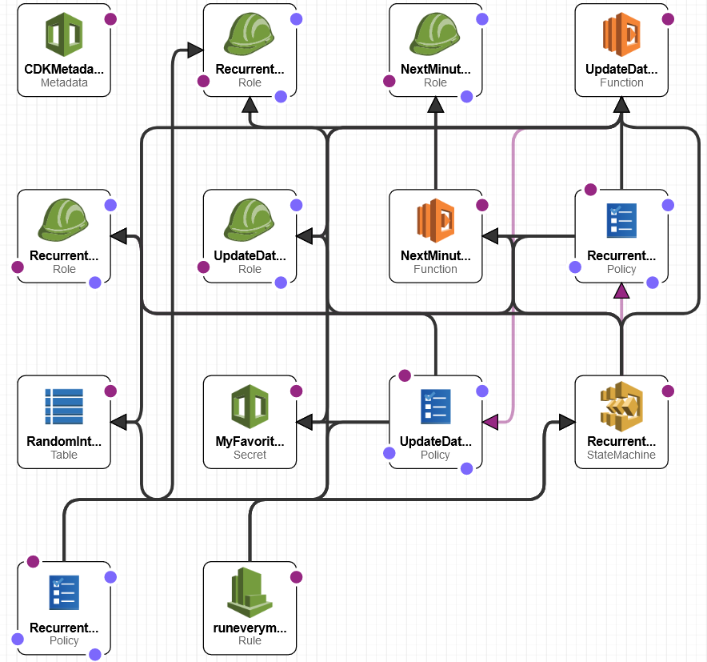
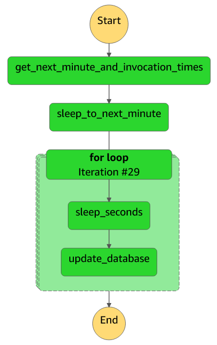

# Welcome to Recurrent Process (Oracle) Microservice
In blockchain, smart contracts often need data from the external world. A blockchain Oracle fulfills this role by publishing data onto the blockchain such that smart contracts have access to high-quality data. Suppose a blockchain Oracle has to publish frequently, every 2 seconds. This microservice emulates an Oracle publishing every 2 seconds.

# Architecture
Here's the architecture diagram, which looks more intense than what it actually is in real life: 

What the architecture entails is Eventbridge that schedules an event every 1 minute, which triggers a Step Function. Because the Eventbridge event does not trigger exactly at the beginning of the minute, the 1st Lambda in the Step Function determines what is the next minute and also the timestamps for all 2 second intervals in that minute. The Step Function then sleeps until precisely until the start of the next minute. In the Step Function's "for loop" (which is a Map state in Step Function terminology), it waits 2 seconds and then triggers a Lambda that publishes a value to DynamoDB table, rinse and repeat for the entire minute.

## Miscellaenous Details
* The Map state's timer is not perfect: the Lambda publishing to DynamoDB table may be up to 1 second early, but it's never late. Here's the Step Function diagram: 

* The Lambda also reads a secret from Secret Manager as proof of concept that you can keep secret values that the Lambda can access during invocation.
* A Dead-letter queue can be added to make the messaging from Eventbridge to Step Function more fault-tolerant in that if any Step Function invocation fails, then put the message into the DLQ. If there's also an alarm on the DLQ, then an engineer can be informed when a Step Function inovcation failed and determine root cause.

# Deploy this Microservice
Deploying on AWS Cloudshell is easiest because it already has a sufficiently updated version of AWS CLI, node (at least v16), CDK Toolkit (at least v2) already installed.
* `git clone THIS_REPO`
* `cd Recurrent-Process-Microservice`
* `python -m venv .venv`  # create virtualenv
* `source .venv/bin/activate`  # activate virtualenv
* `python -m pip install -r requirements.txt`  # install Python CDK
* `cdk bootstrap`  # 1-time step up for AWS account
* `cdk deploy`  # deploy this microservice

If you want to run this on your laptop, then you can install AWS CLI, node.js, and CDK Toolkit by following the instructions here: https://cdkworkshop.com/15-prerequisites.html
* To see the version of node, run `node --version`
* To see the version of CDK toolkit, run `cdk --version`

# TODO
* add unit tests if requested